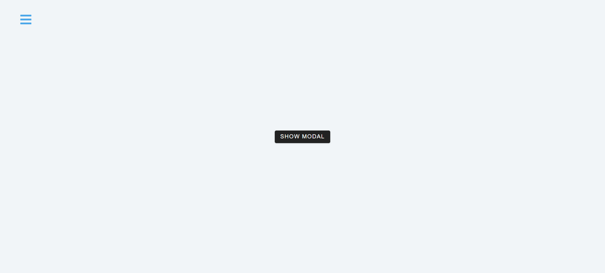
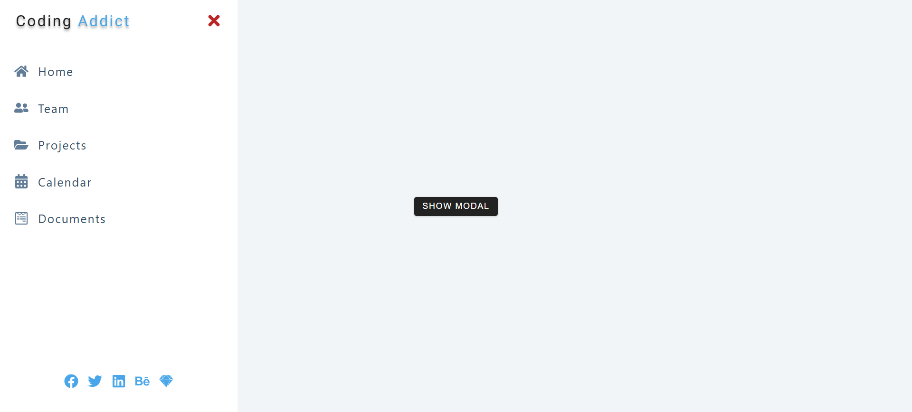
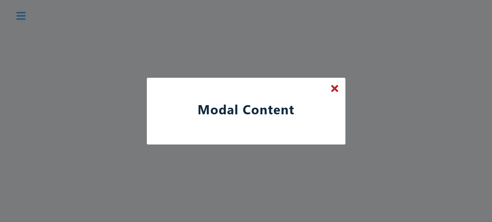

# React Sidebar & Modal

A clean and interactive React application demonstrating advanced state management using the **Context API** and **Custom Hooks**. This project features a responsive sidebar and a smooth modal overlay system.

## 📸 Screenshots

| Home (Closed) | Sidebar Open | Modal Open |
| :---: | :---: | :---: |
|  |  |  |

## ✨ Features

- **Context API Implementation**: Centralized state management for UI components (Sidebar/Modal).
- **Custom Hooks**: Encapsulated logic using `useGlobalContext` for cleaner component code.
- **Responsive Sidebar**: Animated sidebar with navigation links and social media integration.
- **Modal Overlay**: Smooth modal window with a backdrop/overlay effect.
- **React Icons**: Integration with `react-icons/fa` for a professional look.

## 🛠️ Tech Stack

- **React**: Functional components and Hooks (`useState`, `useContext`).
- **CSS3**: Custom animations and responsive layouts.
- **React Icons**: Font Awesome icon set.
- **Context API**: Global state sharing.

## 🏁 Getting Started

1. **Install Dependencies**:
   ```bash
   npm install
   ```

2. **Run Development Server**:
   ```bash
   npm start
   ```

## 🏗 Project Structure

- `src/context.js`: Contains the `AppProvider` and the custom `useGlobalContext` hook.
- `src/Home.js`: The main landing view with toggle buttons.
- `src/Sidebar.js`: Navigation component.
- `src/Modal.js`: Overlay component.
- `src/data.js`: Mock data for links and social icons.

---

> [!NOTE]
> This project is part of a React Advanced tutorial series focusing on clean architecture and scalable state management.
